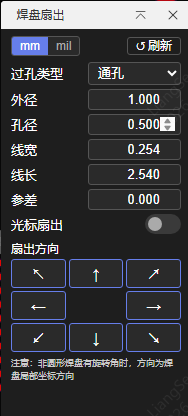

[简体中文](#) | [English](./README.en.md)

# 焊盘扇出

嘉立创EDA专业版 PCB 焊盘扇出过孔插件 v2.3.1

## 功能介绍

在 PCB 设计中，对选中的焊盘自动创建扇出过孔和走线。

**主要功能：**

- **单焊盘扇出**：选中单个焊盘，通过方向键执行扇出
- **批量扇出**：框选多个焊盘，统一方向批量扇出，按焊盘编号顺序执行
- **方向键扇出**：UI 提供 8 个方向键，圆形焊盘支持 8 方向，其他形状支持 4 方向
- **光标扇出**：开启光标扇出模式后，鼠标点击画布空白处自动判定方向并扇出
- **盲埋孔支持**：自动读取 PCB 设计规则中的盲孔/埋孔配置，支持通孔/盲孔/埋孔选择
- **规则跟随**：启动时自动读取 PCB 设计规则中的过孔尺寸和走线宽度作为默认值，支持 mm/mil 单位自动识别，支持单位切换
- **参差扇出**：框选多焊盘时，可设置参差长度，相邻焊盘交替使用不同扇出长度
- **旋转焊盘支持**：非圆形焊盘有旋转角时，方向键对应焊盘局部坐标方向

## 使用方法

1. 在 EDA 顶部菜单 **焊盘扇出** → **焊盘扇出…** 启动插件
2. 在 PCB 画布中单选或框选焊盘
3. 点击 UI 面板中的方向键执行扇出；或开启「光标扇出」开关后，点击画布空白处执行
4. 可在 UI 面板中调整以下参数：
   - 过孔类型（通孔/盲孔/埋孔）
   - 过孔外径、孔径（mm）
   - 走线宽度、走线长度（mm）
   - 参差长度（mm，用于批量扇出时相邻焊盘交替线长）
5. 点击「↺ 刷新」可重新读取当前 PCB 设计规则  

## 注意事项

- 非圆形焊盘有旋转角时，方向键对应的是焊盘**局部坐标系**方向，而非画布全局方向
- 斜向方向键（↖↗↙↘）仅对圆形焊盘有效，对矩形等焊盘会提示不支持
- 框选多焊盘时，光标扇出以距鼠标最近的焊盘为参考原点判定方向

## 构建

```shell
npm install          # 安装依赖
npm run compile      # 编译 TypeScript → dist/index.js
npm run build        # 编译 + 打包 → build/dist/*.eext
npm run lint         # ESLint 检查
npm run fix          # ESLint 自动修复
```

构建产物 `.eext` 文件位于 `build/dist/`，在 EDA 扩展管理器中导入即可使用。

## 安装

**EDA 专业版 V3：** 顶部菜单 → 高级 → 扩展管理器… → 导入

## 开源许可

[Apache License 2.0](https://choosealicense.com/licenses/apache-2.0/)
