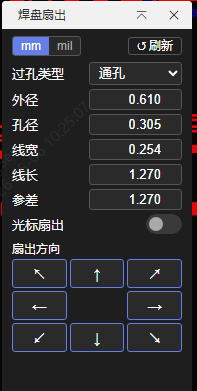

[简体中文](./README.md) | [English](./README.en.md) | [繁體中文](#) | [日本語](./README.ja.md) | [Русский](./README.ru.md)

# 焊盤扇出

嘉立創EDA專業版 PCB 焊盤扇出過孔插件 v2.3.5

## 功能介紹

在 PCB 設計中，對選中的焊盤自動創建扇出過孔和走線。

**主要功能：**

- **單焊盤扇出**：選中單個焊盤，通過方向鍵或參差設置執行扇出
- **批量扇出**：框選多個焊盤，統一方向批量扇出，按焊盤編號順序執行
- **方向鍵扇出**：UI 提供 8 個方向鍵，所有焊盤均支援 8 方向扇出
- **光標扇出**：開啟光標扇出模式後，滑鼠點擊畫布空白處自動判定方向並扇出
- **盲埋孔支援**：自動讀取 PCB 設計規則中的盲孔/埋孔配置，支援通孔/盲孔/埋孔選擇
- **規則跟隨**：啟動時自動讀取 PCB 設計規則中的過孔尺寸和走線寬度作為預設值，支援 mm/mil 單位自動識別與切換
- **網絡規則跟隨**：切換焊盤時，根據焊盤所屬網絡的規則自動更正預設線寬
- **參差扇出**：單焊盤和框選多焊盤均可設置參差長度，相鄰焊盤交替使用不同扇出長度
- **折疊面板**：主面板折疊後彈出迷你彈窗，包含刷新、光標扇出開關和展開按鈕
- **旋轉焊盤支援**：非圓形焊盤有旋轉角時，方向鍵對應輪盤一致方向
- **設置記憶**：保存上次打開擴展時的線長設置

## 使用方法

1. 在 EDA 頂部選單 **焊盤扇出** → **焊盤扇出…** 啟動插件
2. 在 PCB 畫布中單選或框選焊盤
3. 點擊 UI 面板中的方向鍵執行扇出；或開啟「光標扇出」開關後，點擊畫布空白處執行
4. 可在 UI 面板中調整以下參數：
   - 過孔類型（通孔/盲孔/埋孔）
   - 過孔外徑、孔徑（mm/mil）
   - 走線寬度、走線長度（mm/mil）
   - 參差長度（用於扇出時交替線長）
5. 點擊「↺ 刷新」可重新讀取當前 PCB 設計規則
6. 點擊「−」可折疊主面板，折疊後出現迷你彈窗



## 注意事項

- 框選多焊盤時，光標扇出以距滑鼠最近的焊盤為參考原點判定方向

## 構建

```shell
npm install          # 安裝依賴
npm run compile      # 編譯 TypeScript → dist/index.js
npm run build        # 編譯 + 打包 → build/dist/*.eext
npm run lint         # ESLint 檢查
npm run fix          # ESLint 自動修復
```

構建產物 `.eext` 文件位於 `build/dist/`，在 EDA 擴展管理器中導入即可使用。

## 安裝

**EDA 專業版 V3：** 頂部選單 → 進階 → 擴展管理器… → 導入

## 開源許可

[Apache License 2.0](https://choosealicense.com/licenses/apache-2.0/)
